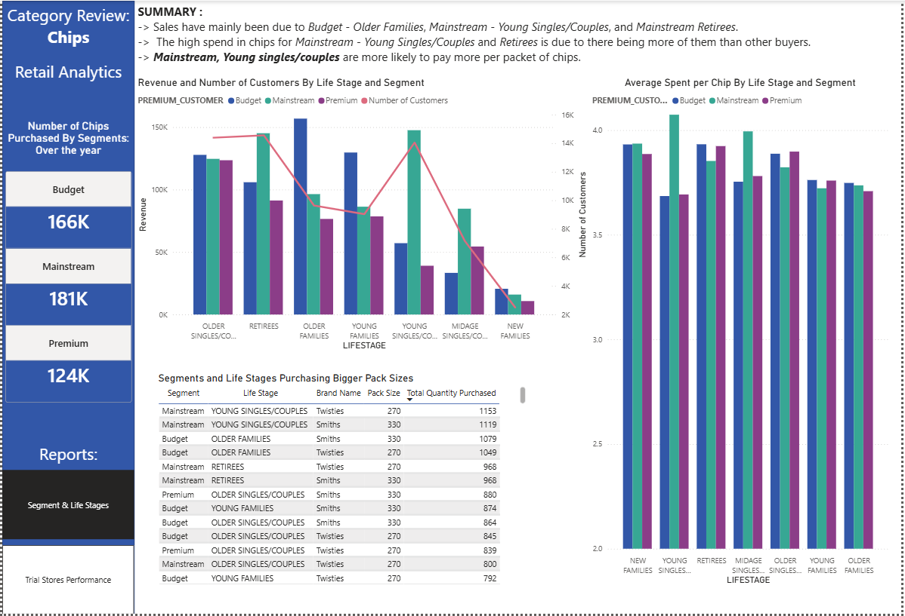

# Customer Purchasing Behavior & Store Trial Evaluation

## TL;DR

A chip category review for a retail chain, using one year of transaction and
customer data (Jul 2018–Jun 2019) to explain **who** drives chip sales and
whether a 3-store layout trial actually worked.

**Finding:** Three segment/life-stage combinations — Budget Older
Families, Mainstream Young Singles/Couples, and Mainstream Retirees —
each individually out-earn every other combination in the customer base,
and the spending premium from Mainstream Young Singles/Couples is
statistically confirmed (ANOVA, p ≈ 4.4e-267). On the trial side, 
2 of 3 trial stores showed a consistent, statistically matched positive 
lift in revenue and customers during the trial period; the third was 
inconclusive due to a weak control-store match.

**Stack:** Python (Pandas, Matplotlib, Seaborn, SciPy) · Jupyter · Power BI
**Deliverables:** 3 Jupyter notebooks (cleaning → customer analysis → store
trial evaluation) · 2-page Power BI dashboard — [screenshots below](#dashboard)

---

## Executive Summary

This project analyzes a full year of transaction and customer-loyalty-card data 
for a chip category, addressing two linked business questions: **which customers
actually drive chip sales, and did a recent in-store trial layout change
increase sales?**

The customer-side analysis shows that revenue is not evenly spread across
the customer base. When segment and life stage are broken out together,
three combinations (Budget Older Families, Mainstream Young
Singles/Couples, Mainstream Retirees) each individually outperform every
other combination, but for different reasons. The two Mainstream groups
lead through headcount rather than high spend per person, while Budget
Older Families buy often and purchase more per visit. A closer look
at Mainstream Young Singles/Couples confirms they
pay a statistically significant premium per pack (ANOVA, p ≈ 4.4e-267) and
show a measurable brand affinity toward Tyrrells - evidence of impulse,
premium-driven buying.

The store-trial analysis evaluates three trial stores (77, 86, 88) that ran
a modified layout from February–April 2019, against control stores selected
by Pearson correlation on pre-trial revenue and customer counts. Store 77
showed an initial dip followed by strong growth (+68.3% revenue, +69.9%
customers by April); Store 86 showed steady, moderate growth throughout;
Store 88's result was set aside as unreliable due to a weak control-store
match. Two of three trial stores support a positive effect, but the sample
size is too small to confirm this formally - the recommendation is to extend
or expand the trial before a full rollout.

---

## Project Structure

```
Customer-Purchasing-Behavior-And-Store-Trial-Evaluation/
│
├── data/
│   ├── raw/
│   │   ├── QVI_transaction_data.xlsx        # Raw transactions, Jul 2018–Jun 2019
│   │   └── QVI_purchase_behaviour.csv       # Customer dimension: LIFESTAGE,
│   │                                        # PREMIUM_CUSTOMER segment
│   └── processed/
│       └── clean_QVI_transactions_data.csv  # Output of 01_Clean_transactions.ipynb
│
├── notebooks/
│   ├── 01_Clean_transactions.ipynb          # Data validation, deduplication,
│   │                                        # brand/pack-size extraction, outlier
│   │                                        # review, produces the clean CSV
│   ├── 02_Customer_Analysis.ipynb           # Segment/lifestage revenue breakdown,
│   │                                        # ANOVA significance test, brand and
│   │                                        # pack-size affinity (lift) analysis
│   └── 03_Store_Analysis.ipynb              # Control-store selection via Pearson
│                                            # correlation, scaled trial-vs-control
│                                            # comparison, reliability assessment
│
├── report/
│   ├── Retail_Analytics_Chips_report.pbix   # Power BI dashboard (2 report pages)
│   └── screenshots/
│       ├── Segments & LifeStages.png        # Page 1 preview
│       └── Trial Stores Performace.png      # Page 2 preview
│
└── README.md
```

**Pipeline order:** `01` cleans the raw transaction file, extracts brand
name and pack size from the product description, flags chip vs. non-chip
products, and writes `data/processed/clean_QVI_transactions_data.csv`. Both
`02` and `03` read from this cleaned file — `02` joins it to the customer
dimension file for segment analysis, `03` uses it standalone for the
store-level trial evaluation. `02` and `03` are independent of each other
and can be run in either order.

---

## Tech Stack

| Tool | Role |
|---|---|
| **Python 3 — Pandas** | Data cleaning, feature extraction, aggregation |
| **Matplotlib / Seaborn** | Exploratory and presentation-quality charts |
| **SciPy (stats)** | ANOVA (unit-price significance) and Pearson correlation (control-store matching) |
| **Power BI** | Executive-facing dashboard and data visualization |

---

## Dashboard

The Power BI dashboard (`report/Retail_Analytics_Chips_report.pbix`)
condenses the notebook findings into two report pages.

---

### Page 1 — Segments & Life Stages



An overview of who buys chips and how much they pay for them.

- **Chips Purchased by Segment** — three KPI cards (Budget 166K, Mainstream
  181K, Premium 124K) giving the headline volume split before any
  segmentation detail.
- **Revenue and Number of Customers by Life Stage and Segment** — a combo
  chart pairing grouped bars (revenue) with a line (customer count) across
  all seven life stages. Retirees and Young Singles/Couples carry the
  highest customer counts, and the line closely tracks the revenue bars for
  most stages — showing that revenue is mostly a function of headcount, not
  outlier spending, except where the two visibly diverge.
- **Average Spent per Chip by Life Stage and Segment** — a bar chart
  isolating unit price. Young Singles/Couples stands out as the one stage
  where Mainstream customers pay a clear premium over Budget and Premium —
  the pattern the ANOVA test in notebook 02 confirms is statistically real.
- **Segments and Life Stages Purchasing Bigger Pack Sizes** — a table
  ranking segment/life-stage/brand combinations by total quantity of large
  packs purchased, surfacing Twisties (270g) and Smiths (330g) as the
  packs driving bulk purchasing among Mainstream and Budget Older Families.

---

### Page 2 — Trial Stores Performance


A side-by-side comparison of each trial store against its matched control
store across the three trial months (February–April 2019).

- **Quantity of Chips Sold During the Trial** — two KPI cards (Store 77:
  219, Store 86: 757) giving raw trial-period volume before the
  scaled comparison.
- **Trial Period Revenue Comparison** — grouped bar charts (Store 77 vs.
  233, Store 86 vs. 155) plotting scaled control-store revenue against
  actual trial-store revenue month by month. Store 77 opens below its
  control in February and pulls decisively ahead by April; Store 86 shows
  steady, consistent growth over its control across all three months.
- **Trial Period Number of Customers Comparison** — the same structure
  applied to customer counts (Store 77 vs. 233, Store 86 vs. 155),
  confirming the revenue pattern is driven by more customers, not just
  bigger baskets.

---

## Key Findings

**1. Three Segment/Life-Stage Combinations Each Individually Lead Revenue, for Different Reasons**
When customers are broken out by both segment and life stage (21
combinations in total), Budget – Older Families, Mainstream – Young
Singles/Couples, and Mainstream – Retirees each individually outperform
every other combination - but not for the same reason. The two Mainstream
groups lead through headcount, not higher spend per person. Budget – Older
Families is the opposite: a smaller customer base that buys frequently and 
spends more per visit.

**2. The Young Singles/Couples Price Premium Is Statistically Real**
Mainstream – Young Singles/Couples pay a visibly higher price per pack than
their Budget or Premium counterparts. An ANOVA test across the three
segments confirms this is not noise (p ≈ 4.4e-267), strong enough evidence
to act on with confidence.

**3. Mainstream Young Singles/Couples Show a Clear Premium-Brand Affinity**
This segment is 23% more likely to buy Tyrrells and 56% less likely to buy
Burger Rings than the rest of the customer base, consistent with
premium-leaning, impulse-driven purchasing rather than routine restocking.

**4. Two of Three Trial Stores Show a Consistent Positive Lift**
Using Pearson correlation on pre-trial revenue and customer counts to
select a matched control store, then scaling the control's trial-period
metrics for a fair comparison: Store 77 dipped in February (–9.8% revenue)
before surging in March and April (up to +68.3% revenue, +69.9% customers).
Store 86 grew steadily across all three months without the initial dip.

**5. Store 88's Result Was Explicitly Set Aside as Unreliable**
Store 88 showed an extreme March spike (+170.8% revenue), but its matched
control store had a weak correlation score (0.48 on revenue), so this
result is flagged rather than reported as a finding. The dataset does not
support a formal significance test given the sample size (three trial
months, one store per pairing) — the honest conclusion is "encouraging,
not proven."

---

## Recommendations

**Customer strategy:** Prioritize retention and acquisition for Budget –
Older Families, Mainstream – Young Singles/Couples, and Mainstream –
Retirees, since each individually outperforms every other segment/life-stage
combination in the category. For
Mainstream – Young Singles/Couples specifically, lean into premium product
placement, targeted promotions, and new premium SKUs (e.g. Tyrrells) rather
than discount-driven campaigns — their behavior is price-insensitive on the
premium end, not price-sensitive. For Budget – Older Families, favor
bulk-pack or family-size offers over blanket discounting, since their value
comes from purchase volume.

**Store trial:** The positive trend in 2 of 3 trial stores is encouraging
enough to justify extending the trial duration for more data, or re-running
it in additional stores with stronger control-store matches (particularly
to resolve the Store 88 gap), before committing to a full chain-wide
rollout.

---

## Data Notes & Limitations

- The dataset covers one fiscal year, **1 July 2018 – 30 June 2019**;
  seasonal comparisons (e.g. the December revenue spike, the February dip)
  are within-year only and not validated against a second year.
- One fully duplicated transaction row was identified and removed during
  cleaning; all other duplicate `TXN_ID` values were confirmed to be
  legitimate multi-item baskets, not errors.
- Two products (`Burger Rings 220g`, `French Fries Potato Chips 175g`) had
  no parseable brand name in their product description and were manually
  assigned short brand codes for consistency.
- Two high-value transactions (>$50) were investigated rather than dropped,
  and confirmed to be a legitimate bulk purchase by a single customer —
  retained in the final dataset.
- The store-trial control matching relies on Pearson correlation over only
  7 pre-trial months per store; Store 88's control-store match (14) was
  weak (0.48 revenue correlation), and its trial-period results are
  reported but explicitly flagged as unreliable rather than treated as a
  finding.
- With only 3 trial stores and 3 trial months, the sample size is too small
  to run a formal significance test (t-test / Mann-Whitney U) on the trial
  effect — the conclusion is directional, not statistically confirmed.
- This project is based on the **Quantium Retail Strategy & Analytics
  virtual experience program on Forage**, which supplies the dataset and
  the core brief (clean the data, profile customers, evaluate the trial
  stores). The ANOVA significance test, the brand/pack-size affinity (lift)
  analysis, the correlation-based control-store selection with scaling
  adjustment, and the Power BI report are original extensions beyond the
  base task.

---

## How to Reproduce

**Requirements:** Python 3.9+, Jupyter, Power BI Desktop (optional, for the
`.pbix` file)

```bash
# 1. Clone the repository
git clone https://github.com/syLvester03/Customer-Purchasing-Behavior-And-Store-Trial-Evaluation.git

# 2. Install Python dependencies
pip install pandas matplotlib seaborn scipy openpyxl jupyter

# 3. Run the notebooks in order
#    - 01_Clean_transactions.ipynb   (produces data/processed/clean_QVI_transactions_data.csv)
#    - 02_Customer_Analysis.ipynb    (segment analysis, ANOVA, affinity)
#    - 03_Store_Analysis.ipynb       (control-store matching, trial evaluation)

# 4. Open the dashboard
# Open report/Retail_Analytics_Chips_report.pbix in Power BI Desktop
```